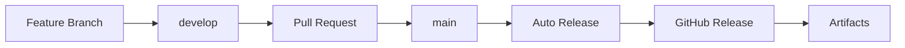

# 🏷️ Semantic Versioning & Auto Release

Project ini menggunakan **Semantic Versioning** dengan **Conventional Commits** untuk membuat release otomatis ketika ada merge ke branch `main`.

## 📋 Cara Kerja

### 1. Conventional Commits

Gunakan format commit message yang mengikuti [Conventional Commits](https://www.conventionalcommits.org/):

```
<type>[optional scope]: <description>

[optional body]

[optional footer(s)]
```

### 2. Tipe Commit dan Versioning

| Tipe Commit | Versi Yang Naik | Contoh |
|-------------|-----------------|--------|
| `fix:` | PATCH (0.0.x) | `fix: resolve file upload bug` |
| `feat:` | MINOR (0.x.0) | `feat: add drag and drop upload` |
| `BREAKING CHANGE:` | MAJOR (x.0.0) | `feat!: change API response format` |
| `docs:`, `style:`, `refactor:`, `test:`, `chore:` | PATCH (0.0.x) | `docs: update README` |

### 3. Contoh Commit Messages

#### ✅ **PATCH** Release (0.0.x)
```bash
git commit -m "fix: resolve memory leak in cleanup service"
git commit -m "docs: add installation instructions"
git commit -m "test: add unit tests for upload handler"
git commit -m "chore: update dependencies"
```

#### ✅ **MINOR** Release (0.x.0)
```bash
git commit -m "feat: add file preview functionality"
git commit -m "feat(api): add batch upload endpoint"
```

#### ✅ **MAJOR** Release (x.0.0)
```bash
git commit -m "feat!: change upload API to use multipart form

BREAKING CHANGE: Upload endpoint now requires multipart/form-data instead of JSON"
```

## 🚀 Workflow Release

### Otomatis (Recommended)
1. Buat commit dengan conventional format
2. Push/merge ke branch `main`
3. GitHub Actions akan:
   - Analisis commit messages
   - Menentukan versi baru
   - Build multi-platform binaries
   - Membuat release GitHub
   - Upload artifacts

### Manual Skip Release
Jika ingin skip release, tambahkan flag di commit message:
```bash
git commit -m "chore: update config [skip-release]"
# atau
git commit -m "docs: fix typo [no-release]"
```

## 📦 Artifacts Yang Dibuat

Setiap release akan menghasilkan:

- `tempfile-linux-amd64.tar.gz` - Linux 64-bit
- `tempfile-linux-arm64.tar.gz` - Linux ARM64
- `tempfile-darwin-amd64.tar.gz` - macOS Intel
- `tempfile-darwin-arm64.tar.gz` - macOS Apple Silicon
- `tempfile-windows-amd64.zip` - Windows 64-bit
- `tempfile-docker-{version}.tar.gz` - Docker image
- `checksums.txt` - SHA256 checksums

## 🔧 Konfigurasi

### Files yang terlibat:
- `.github/workflows/release.yml` - Workflow utama
- `.releaserc.json` - Konfigurasi semantic-release
- `package.json` - Dependencies untuk semantic-release

### Permissions yang diperlukan:
- `contents: write` - Untuk membuat release
- `issues: write` - Untuk update issues
- `pull-requests: write` - Untuk update PR

## 📊 Build Information

Setiap binary akan include informasi build:
- Version number
- Git commit SHA
- Build timestamp

Bisa diakses dengan `./tempfile --version` (jika implemented)

## 🔄 Development Workflow



### Branching Strategy:
- `feature/*` - Feature development
- `develop` - Development branch (CI/CD testing)
- `main` - Production releases (auto-release)

## 🎯 Best Practices

1. **Selalu gunakan conventional commits**
2. **Test di branch develop sebelum merge ke main**
3. **Gunakan scopes untuk organisasi**: `feat(api):`, `fix(ui):`, dll
4. **Breaking changes harus explicit**: gunakan `!` atau `BREAKING CHANGE:`
5. **Dokumentasikan perubahan penting di commit body**

## 🛠️ Troubleshooting

### Release tidak terbuat?
- Pastikan commit message mengikuti conventional format
- Check apakah ada flag `[skip-release]`
- Lihat logs di GitHub Actions

### Version tidak sesuai harapan?
- Review tipe commit yang digunakan
- Pastikan breaking changes marked dengan `!` atau `BREAKING CHANGE:`

### Build gagal?
- Check Go code compile tanpa error
- Pastikan semua dependencies tersedia
- Review error di GitHub Actions logs

---

## 📖 Resources

- [Conventional Commits](https://www.conventionalcommits.org/)
- [Semantic Versioning](https://semver.org/)
- [Keep a Changelog](https://keepachangelog.com/)
