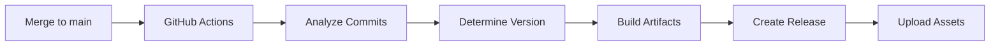

# 📋 Semantic Versioning & Release Setup Summary

## ✅ Berhasil Ditambahkan

### 🤖 GitHub Actions Workflows

1. **`.github/workflows/release.yml`** - Workflow utama untuk semantic versioning & auto-release
   - Triggered ketika push ke `main` branch
   - Menganalisis conventional commits
   - Menentukan versi otomatis (MAJOR.MINOR.PATCH)
   - Build multi-platform binaries
   - Membuat GitHub Release dengan changelog
   - Upload artifacts ke GitHub Releases

2. **`.github/workflows/test.yml`** - Workflow untuk testing dan validasi
   - Triggered pada PR dan feature branches
   - Validasi format commit message
   - Quality checks (test, lint, security)
   - Docker build test

3. **`.github/workflows/build.yml`** - Development builds (sudah diupdate)
   - Triggered pada develop dan feature branches
   - Testing dan build untuk development

### 🔧 Konfigurasi Files

4. **`.releaserc.json`** - Konfigurasi semantic-release
   - Conventional commits rules
   - Release notes generation
   - Changelog management
   - GitHub release configuration

5. **`package.json`** - Dependencies untuk semantic-release
   - NPM packages yang dibutuhkan untuk release automation

### 📚 Dokumentasi

6. **`SEMANTIC_VERSIONING.md`** - Panduan lengkap semantic versioning
   - Cara kerja conventional commits
   - Contoh commit messages
   - Workflow development
   - Best practices

7. **`CONTRIBUTING.md`** - Panduan kontribusi developer
   - Development setup
   - Code style guidelines
   - PR process
   - Commit message format

8. **`QUICK_START.md`** - Panduan cepat untuk user dan developer
   - Installation options
   - Development workflow
   - Common commands

9. **`CHANGELOG.md`** - Changelog file (akan otomatis diupdate)

### 🛠️ Development Tools

10. **`dev.sh`** - Script helper untuk development
    - Setup environment
    - Interactive commit helper
    - Build commands
    - Quality checks

11. **`Makefile`** (updated) - Make commands untuk development
    - `make setup` - First time setup
    - `make dev` - Development server
    - `make commit` - Interactive commit
    - `make check` - Quality checks
    - Dan banyak lagi...

12. **`.gitignore`** (updated) - Ignore files untuk release artifacts

## 🚀 Cara Kerja

### 1. Development Workflow
```bash
# Setup pertama kali
make setup

# Development sehari-hari
git checkout -b feature/amazing-feature
# ... buat perubahan ...
make test
make check
make commit  # Interactive commit helper
git push origin feature/amazing-feature
# ... buat PR ...
```

### 2. Automatic Release Process


### 3. Conventional Commits
| Type | Version Bump | Example |
|------|--------------|---------|
| `fix:` | PATCH (0.0.X) | `fix: resolve upload bug` |
| `feat:` | MINOR (0.X.0) | `feat: add drag drop upload` |
| `feat!:` | MAJOR (X.0.0) | `feat!: change API format` |

## 📦 Release Artifacts

Setiap release akan menghasilkan:
- ✅ Linux AMD64 binary
- ✅ Linux ARM64 binary  
- ✅ macOS AMD64 binary
- ✅ macOS ARM64 binary
- ✅ Windows AMD64 binary
- ✅ Docker image
- ✅ SHA256 checksums
- ✅ Automated changelog

## 🎯 Langkah Selanjutnya

### Untuk Testing Release
1. **Buat commit dengan conventional format**:
   ```bash
   git add .
   git commit -m "feat: add semantic versioning and auto-release"
   ```

2. **Push ke main branch**:
   ```bash
   git push origin main
   ```

3. **Monitor GitHub Actions**:
   - Lihat di tab Actions apakah workflow berjalan
   - Check release yang dibuat otomatis

### Untuk Development
1. **Setup development environment**:
   ```bash
   make setup
   ```

2. **Mulai development**:
   ```bash
   make dev
   ```

3. **Gunakan commit helper**:
   ```bash
   make commit
   ```

## 🔧 Troubleshooting

### Jika Release Tidak Terbuat
- ✅ Pastikan commit message mengikuti conventional format
- ✅ Check tidak ada flag `[skip-release]` di commit
- ✅ Lihat GitHub Actions logs untuk error

### Jika Build Gagal
- ✅ Pastikan semua tests passing
- ✅ Check Go code compile tanpa error
- ✅ Review dependencies di go.mod

### GitHub Actions Permissions
Pastikan repository settings memiliki:
- ✅ `contents: write` - Untuk membuat release
- ✅ `actions: write` - Untuk workflow

## 📋 File Summary

### New Files Created:
```
.github/workflows/
├── release.yml          # Main release workflow
└── test.yml            # Testing & validation workflow

.releaserc.json         # Semantic release config
package.json            # NPM dependencies
SEMANTIC_VERSIONING.md  # Versioning guide
CONTRIBUTING.md         # Contributing guide
QUICK_START.md         # Quick start guide
CHANGELOG.md           # Changelog file
dev.sh                 # Development helper script
```

### Updated Files:
```
.github/workflows/build.yml  # Updated triggers
README.MD                    # Added badges & versioning info
Makefile                     # Added development commands
.gitignore                   # Added release artifacts
```

## 🎉 Kesimpulan

Semantic versioning dan auto-release system telah berhasil diimplementasikan! 

**Features:**
- ✅ Automatic version bumping berdasarkan conventional commits
- ✅ Multi-platform binary builds
- ✅ GitHub Release creation dengan changelog
- ✅ Comprehensive development workflows
- ✅ Quality checks dan testing automation
- ✅ Developer-friendly tools dan dokumentasi

**Ready to use!** 🚀

Coba commit pertama dengan format conventional dan push ke main untuk melihat release automation bekerja.
