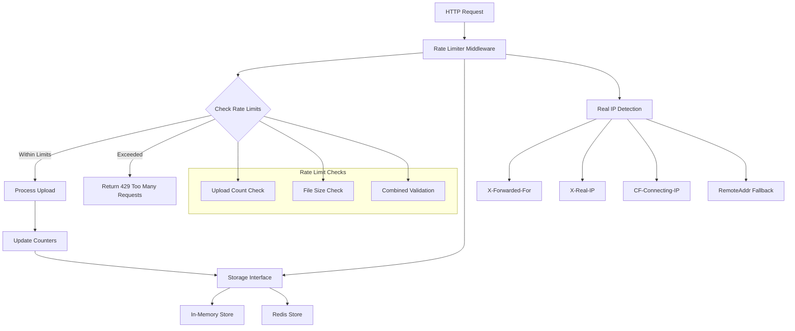
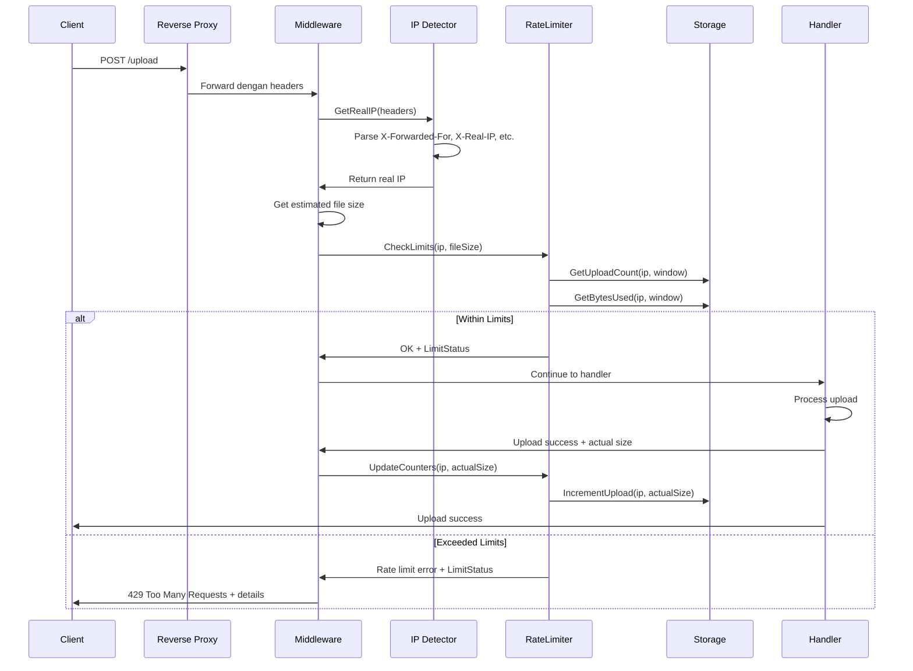

# 📋 Rate Limiter Implementation Plan untuk TempFiles

## 🎯 Objektif
Mengimplementasikan rate limiter kombinasi yang membatasi:
- **Jumlah upload** per IP dalam periode waktu tertentu
- **Total ukuran file** per IP dalam periode waktu tertentu
- **Hybrid storage** (in-memory default, Redis untuk production)
- **Real IP detection** untuk aplikasi di belakang reverse proxy

## 🏗️ Arsitektur Rate Limiter



## 📁 Struktur File Baru

```
docs/
└── rate-limiter-plan.md           # Dokumen ini
internal/
├── middleware/
│   └── ratelimiter.go              # Rate limiter middleware
├── ratelimit/
│   ├── interface.go                # Storage interface
│   ├── memory.go                   # In-memory implementation
│   ├── redis.go                    # Redis implementation
│   ├── limiter.go                  # Core rate limiter logic
│   ├── config.go                   # Rate limit configuration
│   └── ipdetector.go               # Real IP detection logic
└── config/
    └── config.go                   # Updated dengan rate limit config
```

## 🔧 Komponen Detail

### 1. Configuration Extension
**File**: `internal/config/config.go`

Tambahan konfigurasi:
```go
// Rate limiting config
EnableRateLimit              bool
RateLimitStore              string    // "memory" atau "redis"
RateLimitUploadsPerMinute   int
RateLimitBytesPerHour       int64
RateLimitWindowMinutes      int
RateLimitTrustedProxies     []string  // Trusted proxy IPs
RateLimitIPHeaders          []string  // Custom IP headers priority

// Redis config
RedisURL                    string
RedisPassword               string
RedisDB                     int
RedisPoolSize               int
RedisTimeout                int
```

### 2. Real IP Detection
**File**: `internal/ratelimit/ipdetector.go`

```go
type IPDetector struct {
    trustedProxies map[string]bool
    headerPriority []string
}

func (d *IPDetector) GetRealIP(c *fiber.Ctx) string {
    // Priority order untuk header checking:
    // 1. CF-Connecting-IP (Cloudflare)
    // 2. X-Real-IP (Nginx)
    // 3. X-Forwarded-For (Standard, ambil IP pertama)
    // 4. X-Forwarded (RFC 7239)
    // 5. Forwarded-For
    // 6. RemoteAddr (fallback)
    
    // Validasi trusted proxy
    // Parse dan validate IP format
    // Return sanitized IP
}
```

### 3. Rate Limiter Interface
**File**: `internal/ratelimit/interface.go`

```go
type Store interface {
    GetUploadCount(ip string, window time.Duration) (int, error)
    GetBytesUsed(ip string, window time.Duration) (int64, error)
    IncrementUpload(ip string, fileSize int64, window time.Duration) error
    Cleanup() error
    HealthCheck() error
}

type RateLimiter interface {
    CheckLimits(ip string, fileSize int64) (*LimitStatus, error)
    UpdateCounters(ip string, fileSize int64) error
    GetStatus(ip string) (*LimitStatus, error)
}

type LimitStatus struct {
    IP                string    `json:"ip"`
    UploadsUsed       int       `json:"uploads_used"`
    UploadsLimit      int       `json:"uploads_limit"`
    BytesUsed         int64     `json:"bytes_used"`
    BytesLimit        int64     `json:"bytes_limit"`
    WindowStart       time.Time `json:"window_start"`
    WindowEnd         time.Time `json:"window_end"`
    ResetTime         time.Time `json:"reset_time"`
    IsLimited         bool      `json:"is_limited"`
    LimitReason       string    `json:"limit_reason,omitempty"`
}
```

### 4. Storage Implementations

**In-Memory Store** (`internal/ratelimit/memory.go`):
```go
type MemoryStore struct {
    mu          sync.RWMutex
    uploads     map[string][]UploadRecord
    maxEntries  int
    cleanupTick time.Duration
}

type UploadRecord struct {
    Timestamp time.Time
    FileSize  int64
}
```

**Redis Store** (`internal/ratelimit/redis.go`):
```go
type RedisStore struct {
    client      *redis.Client
    keyPrefix   string
    maxRetries  int
}

// Menggunakan Redis Sorted Sets dengan timestamp sebagai score
// Key format: "ratelimit:uploads:{ip}" dan "ratelimit:bytes:{ip}"
// Lua scripts untuk atomic operations
```

### 5. Middleware Integration
**File**: `internal/middleware/ratelimiter.go`

```go
func New(limiter ratelimit.RateLimiter, detector *ratelimit.IPDetector) fiber.Handler {
    return func(c *fiber.Ctx) error {
        // Skip rate limiting untuk health check
        if c.Path() == "/health" {
            return c.Next()
        }
        
        // Extract real IP address
        ip := detector.GetRealIP(c)
        
        // Get file size dari multipart form (pre-validation)
        fileSize := getEstimatedFileSize(c)
        
        // Check rate limits
        status, err := limiter.CheckLimits(ip, fileSize)
        if err != nil {
            return handleRateLimitError(c, err, status)
        }
        
        // Store IP dan file size untuk post-processing
        c.Locals("rate_limit_ip", ip)
        c.Locals("rate_limit_checked", true)
        
        return c.Next()
    }
}

func PostProcess(limiter ratelimit.RateLimiter) fiber.Handler {
    return func(c *fiber.Ctx) error {
        // Update counters setelah upload berhasil
        if c.Locals("rate_limit_checked") == true {
            ip := c.Locals("rate_limit_ip").(string)
            actualSize := c.Locals("actual_file_size").(int64)
            limiter.UpdateCounters(ip, actualSize)
        }
        return c.Next()
    }
}
```

## 🔄 Alur Kerja Rate Limiter



## 🌐 Real IP Detection Strategy

### Header Priority Order
1. **CF-Connecting-IP** - Cloudflare real IP
2. **X-Real-IP** - Nginx real IP
3. **X-Forwarded-For** - Standard header (ambil IP pertama yang valid)
4. **X-Forwarded** - RFC 7239 format
5. **Forwarded-For** - Alternative format
6. **RemoteAddr** - Direct connection (fallback)

### Trusted Proxy Validation
```go
func (d *IPDetector) isTrustedProxy(ip string) bool {
    // Validate against configured trusted proxies
    // Support CIDR notation (192.168.1.0/24)
    // Default trusted: 127.0.0.1, ::1, private networks
}

func (d *IPDetector) parseForwardedFor(header string) string {
    // Parse "X-Forwarded-For: client, proxy1, proxy2"
    // Return first non-trusted proxy IP
    // Validate IP format dan private/public ranges
}
```

### IP Validation & Sanitization
- Validate IPv4/IPv6 format
- Reject private IPs jika tidak dari trusted proxy
- Normalize IPv6 addresses
- Rate limit berdasarkan /24 subnet untuk IPv4, /64 untuk IPv6 (opsional)

## ⚙️ Konfigurasi Default

```env
# Rate Limiting
ENABLE_RATE_LIMIT=true
RATE_LIMIT_STORE=memory
RATE_LIMIT_UPLOADS_PER_MINUTE=5
RATE_LIMIT_BYTES_PER_HOUR=104857600  # 100MB
RATE_LIMIT_WINDOW_MINUTES=60

# Trusted Proxies (comma separated)
RATE_LIMIT_TRUSTED_PROXIES=127.0.0.1,::1,10.0.0.0/8,172.16.0.0/12,192.168.0.0/16

# Custom IP Headers (priority order, comma separated)
RATE_LIMIT_IP_HEADERS=CF-Connecting-IP,X-Real-IP,X-Forwarded-For

# Redis (untuk production)
REDIS_URL=redis://localhost:6379
REDIS_PASSWORD=
REDIS_DB=0
REDIS_POOL_SIZE=10
REDIS_TIMEOUT=5
```

## 🚀 Implementasi Phases

### Phase 1: Core Infrastructure ⏱️ 2-3 hari
1. ✅ Extend configuration dengan rate limit settings
2. ✅ Create IP detector dengan real IP detection logic
3. ✅ Create rate limiter interfaces dan core logic
4. ✅ Implement in-memory storage dengan sliding window
5. ✅ Create middleware integration dengan pre/post processing

### Phase 2: Redis Support ⏱️ 2 hari
1. ✅ Implement Redis storage backend dengan Lua scripts
2. ✅ Add Redis connection management dan health checks
3. ✅ Create atomic operations untuk concurrent access
4. ✅ Add Redis failover ke in-memory store

### Phase 3: Integration & Testing ⏱️ 2-3 hari
1. ✅ Integrate middleware ke main.go dengan proper ordering
2. ✅ Add comprehensive unit tests untuk semua components
3. ✅ Add integration tests dengan real HTTP requests
4. ✅ Performance benchmarking memory vs Redis
5. ✅ Test dengan berbagai reverse proxy configurations

### Phase 4: Monitoring & Observability ⏱️ 1-2 hari
1. ✅ Add rate limit metrics dan Prometheus integration
2. ✅ Enhanced logging untuk rate limit events
3. ✅ Health check endpoints untuk storage backends
4. ✅ Documentation updates dan deployment guides

## 🔍 Error Handling & Response

### Rate Limit Exceeded Response
```json
{
  "error": "Rate limit exceeded",
  "code": "RATE_LIMIT_EXCEEDED",
  "message": "Upload limit exceeded for your IP address",
  "details": {
    "limit_type": "upload_count",
    "reason": "Maximum 5 uploads per minute exceeded"
  },
  "current_usage": {
    "ip": "203.0.113.1",
    "uploads_used": 6,
    "uploads_limit": 5,
    "bytes_used": 52428800,
    "bytes_limit": 104857600,
    "window_start": "2024-01-01T10:00:00Z",
    "window_end": "2024-01-01T11:00:00Z"
  },
  "retry_after": 45,
  "reset_time": "2024-01-01T10:01:00Z"
}
```

### IP Detection Issues
```json
{
  "error": "Invalid request",
  "code": "IP_DETECTION_FAILED",
  "message": "Unable to determine client IP address",
  "details": {
    "headers_checked": ["X-Forwarded-For", "X-Real-IP"],
    "remote_addr": "127.0.0.1",
    "trusted_proxy": true
  }
}
```

## 📊 Monitoring & Metrics

### Prometheus Metrics
```go
// Counter metrics
rate_limit_requests_total{ip, status, reason}
rate_limit_storage_operations_total{operation, backend, status}

// Histogram metrics  
rate_limit_check_duration_seconds{backend}
rate_limit_cleanup_duration_seconds{backend}

// Gauge metrics
rate_limit_active_ips{backend}
rate_limit_memory_usage_bytes{backend}
rate_limit_redis_connections{status}
```

### Logging Events
```json
{
  "timestamp": "2024-01-01T10:00:00Z",
  "level": "WARN",
  "event": "rate_limit_exceeded",
  "ip": "203.0.113.1",
  "real_ip": "203.0.113.1",
  "detected_via": "X-Forwarded-For",
  "uploads_used": 6,
  "uploads_limit": 5,
  "file_size": 1048576,
  "user_agent": "curl/7.68.0",
  "endpoint": "/upload"
}
```

## 🔒 Security Considerations

### IP Spoofing Protection
- Validate trusted proxy list dengan CIDR notation
- Reject requests dengan invalid IP formats
- Log suspicious IP detection patterns
- Rate limit berdasarkan subnet untuk distributed attacks

### Memory Exhaustion Prevention
- Maximum entries limit untuk in-memory store (default: 10,000 IPs)
- Automatic cleanup expired entries
- Memory usage monitoring dan alerting
- Graceful degradation ketika memory limit tercapai

### Redis Security
- Connection encryption dengan TLS
- Authentication dengan password
- Network isolation dengan VPC/firewall
- Connection pooling dengan timeout limits

### Bypass Prevention
- Rate limit sebelum file parsing untuk mencegah DoS
- Validate file size estimates vs actual size
- Multiple validation points (pre-upload, post-upload)
- Audit trail untuk rate limit bypasses

## 🧪 Testing Strategy

### Unit Tests
```go
// IP Detection Tests
TestIPDetector_GetRealIP_WithCloudflare()
TestIPDetector_GetRealIP_WithNginx()
TestIPDetector_GetRealIP_WithMultipleProxies()
TestIPDetector_GetRealIP_WithInvalidHeaders()

// Rate Limiter Tests
TestRateLimiter_CheckLimits_WithinLimits()
TestRateLimiter_CheckLimits_ExceedsUploadCount()
TestRateLimiter_CheckLimits_ExceedsFileSize()
TestRateLimiter_CheckLimits_CombinedLimits()

// Storage Tests
TestMemoryStore_ConcurrentAccess()
TestRedisStore_AtomicOperations()
TestStore_SlidingWindow()
TestStore_Cleanup()
```

### Integration Tests
```go
// End-to-end Tests
TestRateLimit_E2E_MemoryBackend()
TestRateLimit_E2E_RedisBackend()
TestRateLimit_E2E_WithReverseProxy()
TestRateLimit_E2E_ConcurrentUploads()

// Failover Tests
TestRateLimit_RedisFailover()
TestRateLimit_BackendSwitching()
```

### Performance Tests
```go
// Load Tests
BenchmarkRateLimit_MemoryStore_1000Concurrent()
BenchmarkRateLimit_RedisStore_1000Concurrent()
BenchmarkIPDetection_VariousHeaders()

// Memory Tests
TestMemoryUsage_LongRunning()
TestMemoryLeaks_Cleanup()
```

## 📈 Performance Considerations

### In-Memory Store
- **Pros**: Ultra-fast (< 1ms), no network latency, simple deployment
- **Cons**: Not distributed, memory usage grows, lost on restart
- **Best for**: Single instance, development, small scale
- **Optimization**: Efficient cleanup, memory pooling, batch operations

### Redis Store  
- **Pros**: Distributed, persistent, scalable, atomic operations
- **Cons**: Network latency (1-5ms), additional dependency, complexity
- **Best for**: Production, multi-instance, high availability
- **Optimization**: Connection pooling, Lua scripts, pipeline operations

### Hybrid Approach
- Start dengan in-memory untuk simplicity
- Switch ke Redis untuk production scaling
- Automatic failover dari Redis ke in-memory
- Configuration-driven backend selection

### Performance Targets
- **Rate limit check**: < 5ms (99th percentile)
- **Memory usage**: < 100MB untuk 10,000 active IPs
- **Redis operations**: < 10ms (99th percentile)
- **Cleanup operations**: < 1s untuk 10,000 entries

## 🚀 Deployment Considerations

### Docker Configuration
```yaml
# docker-compose.yml
services:
  tempfiles:
    environment:
      - ENABLE_RATE_LIMIT=true
      - RATE_LIMIT_STORE=redis
      - REDIS_URL=redis://redis:6379
      - RATE_LIMIT_TRUSTED_PROXIES=172.16.0.0/12
  
  redis:
    image: redis:7-alpine
    command: redis-server --maxmemory 256mb --maxmemory-policy allkeys-lru
```

### Reverse Proxy Configuration

**Nginx**:
```nginx
location / {
    proxy_pass http://tempfiles;
    proxy_set_header X-Real-IP $remote_addr;
    proxy_set_header X-Forwarded-For $proxy_add_x_forwarded_for;
    proxy_set_header X-Forwarded-Proto $scheme;
}
```

**Cloudflare**:
```bash
# Environment variables
RATE_LIMIT_TRUSTED_PROXIES=173.245.48.0/20,103.21.244.0/22,103.22.200.0/22,103.31.4.0/22,141.101.64.0/18,108.162.192.0/18,190.93.240.0/20,188.114.96.0/20,197.234.240.0/22,198.41.128.0/17,162.158.0.0/15,104.16.0.0/13,104.24.0.0/14,172.64.0.0/13,131.0.72.0/22
RATE_LIMIT_IP_HEADERS=CF-Connecting-IP,X-Forwarded-For
```

### Kubernetes Deployment
```yaml
apiVersion: apps/v1
kind: Deployment
metadata:
  name: tempfiles
spec:
  template:
    spec:
      containers:
      - name: tempfiles
        env:
        - name: RATE_LIMIT_TRUSTED_PROXIES
          value: "10.0.0.0/8,172.16.0.0/12,192.168.0.0/16"
        - name: REDIS_URL
          value: "redis://redis-service:6379"
```

## 📚 Documentation Updates

### README.md Updates
- Rate limiting feature description
- Configuration options
- Reverse proxy setup guides
- Performance characteristics

### API Documentation
- Rate limit headers dalam responses
- Error codes dan messages
- Rate limit status endpoints

### Deployment Guides
- Docker Compose examples
- Kubernetes manifests
- Reverse proxy configurations
- Monitoring setup

## 🔄 Migration Strategy

### Existing Deployments
1. **Phase 1**: Deploy dengan `ENABLE_RATE_LIMIT=false`
2. **Phase 2**: Enable dengan permissive limits untuk monitoring
3. **Phase 3**: Adjust limits berdasarkan usage patterns
4. **Phase 4**: Enable strict limits untuk production

### Rollback Plan
- Feature flag untuk quick disable
- Graceful degradation tanpa rate limiting
- Monitoring untuk impact assessment
- Configuration rollback procedures

---

## 📋 Implementation Checklist

### Core Components
- [ ] Configuration extension dengan rate limit settings
- [ ] IP detector dengan real IP detection logic  
- [ ] Rate limiter interface dan core logic
- [ ] In-memory storage implementation
- [ ] Redis storage implementation
- [ ] Middleware integration dengan pre/post processing

### Integration
- [ ] Main.go integration dengan proper middleware ordering
- [ ] Error handling dan response formatting
- [ ] Logging integration dengan structured logs
- [ ] Metrics integration dengan Prometheus

### Testing
- [ ] Unit tests untuk semua components
- [ ] Integration tests dengan HTTP requests
- [ ] Performance benchmarks
- [ ] Security testing untuk IP spoofing

### Documentation
- [ ] Configuration documentation
- [ ] API documentation updates
- [ ] Deployment guides
- [ ] Troubleshooting guides

### Deployment
- [ ] Docker configuration updates
- [ ] Environment variable examples
- [ ] Reverse proxy configuration guides
- [ ] Monitoring setup documentation

---

**Total Estimated Time**: 7-10 hari development + 2-3 hari testing & documentation

**Priority**: High (Security & Production Readiness)

**Dependencies**: Redis (optional), Reverse Proxy configuration

**Risk Level**: Medium (New middleware, IP detection complexity)